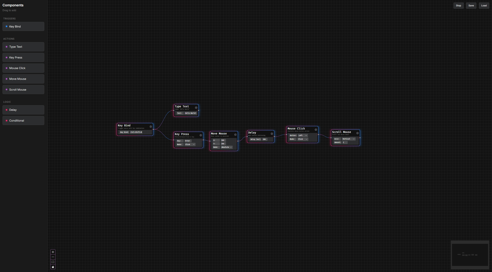

# Macro Center

A Crossplatform Visual Programming/Scripting App for keyboard and mouse macros

## How to build

You need the nightly toolchain of Rust installed.  
For development builds, you also need to install the cranelift backend for better compile times.

```bash
git clone https://github.com/lucascompython/macro-center
cd macro-center
# install deps
cd src && bun install

# build
cd ..
cargo xtask dev
# or
cargo xtask release
```

## Demo


